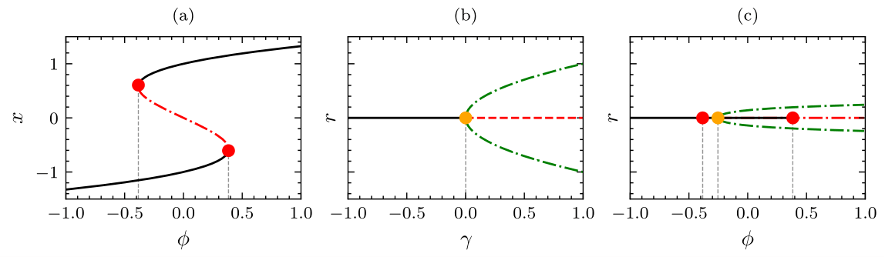

# climate-tipping-points

Investigating tipping points in climatology. In particular, a fold-hopf bifurcation.    
This work has been based on this article from Dekker et al. : https://esd.copernicus.org/articles/9/1243/2018/  



### Installation
Clone the project
```bash
$ git clone https://github.com/Mathieu-R/climate-tipping-points.git
```

Create virtual environment
```bash
$ python3 -m venv <env-name>
$ source env/bin/activate
$ python3 -m pip install --upgrade pip
```

Install required packages
```bash
$ python3 -m pip install -r requirements.txt
```

### Launch simulations
Type `--help` command to show all the possible parameters that are available and how to launch a simulation.
```bash
$ python3 index.py --help
Usage: index.py [OPTIONS]

Options:
  -p, --plot [time-series|bifurcations|phase-plot]
                                  Type de plot à afficher. time-series:
                                  affiche les séries temporelles non-
                                  stochastiques et stochastiques.
                                  bifurcations: affiche les 3 diagrammes de
                                  bifurcations. phase-plot: affiche le
                                  portrait de phase exhibant un cycle limite
                                  du système contenant la bifurcation de hopf.

  --help                          Show this message and exit.
```

For example
```bash
python3 index.py -p time-series
```
